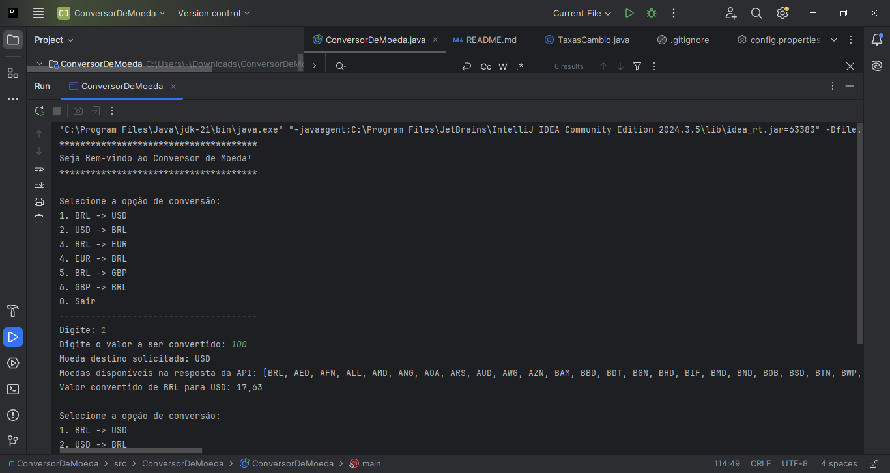
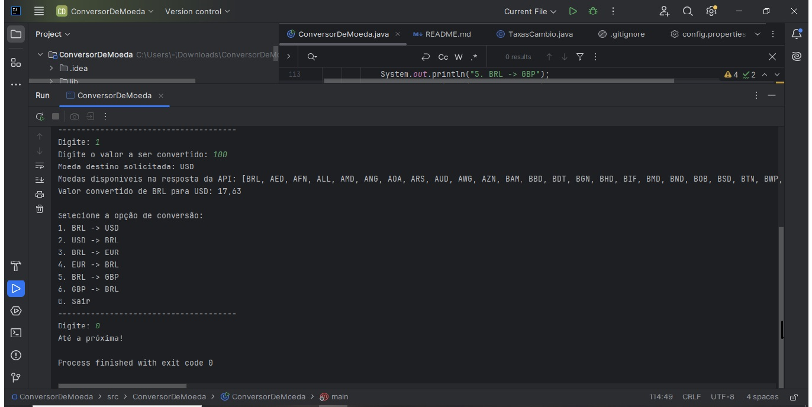

#  Conversor de Moeda 

Este é um projeto simples em Java desenvolvido como parte do programa **Oracle Next Education - G8 ONE** em parceria com a **Alura**. Ele realiza conversões de valores entre moedas com base nas taxas de câmbio fornecidas por uma API externa.

---

##  Funcionalidades

- Menu interativo no console para escolher moedas.
- Conversão de valores em tempo real.
- Consumo de API externa (ExchangeRate API).
- Leitura da chave da API por arquivo externo `.properties`.
- Tratamento de erros e validação de entrada do usuário.

---

##  Tecnologias Usadas

- Java 21+
- API ExchangeRate
- Gson (para tratamento de JSON)
- IntelliJ IDEA (recomendado)
- `.properties` para configuração segura

---

##  Como Usar

1. Execute o programa.
2. Escolha a moeda de origem e de destino (ex: BRL → USD).
3. Informe o valor a ser convertido.
4. Veja o valor convertido exibido no console.

---

##  Como Rodar o Projeto

1. Clone o repositório ou baixe os arquivos.
2. Instale o JDK 21 ou outro inferior, ou superior caso não tenha.
3. Adicione o arquivo `gson.jar` na pasta `lib/`.
4. Crie um arquivo chamado `config.properties` na raiz do projeto.
5. Insira à sua chave API:

   ```properties
   apiKey= Cole aqui sua chave.

##  Requisitos

- Java Development Kit (JDK) 17 ou superior
- IDE (IntelliJ, ou da sua preferência)
- Conexão com a ‘internet’
- Biblioteca `gson-2.13.1`

---
## Captura de Tela
**console** com o programa rodando:

### Console - Exemplo 1


### Console - Exemplo 2



---

## Minha Contribuição

Desenvolvi este projeto com o objetivo de aplicar os conhecimentos aprendidos no programa **ONE - Oracle Next Education**, colocando em prática:

- A lógica de programação com Java
- A leitura e tratamento de arquivos externos
- O consumo de API real
- A organização em pacotes e boas práticas

---

##  Desafios Enfrentados

- Aprender a consumir uma API REST com Java puro
- Configurar  a leitura da chave da API via `.properties`
- Tratar exceções para não quebrar o programa
- Manter o código limpo e organizado dentro da estrutura do projeto
- Resolver erros de digitação
---

##  Melhorias Futuras

- Criar um histórico de conversões
- Adicionar interface gráfica
- Mostrar múltiplas taxas ao mesmo tempo
- Adicionar testes automatizados


---

## 🙏 Créditos

Projeto Desenvolvido por **Ivany Correia**, como parte do desafio do programa **Oracle Next Education G8 ONE** 
em parceria com **Alura + Oracle**.
